# 🃏 You're in Trouble - Card Game  

  

A strategic card game combining luck and tactics, built with Python and Pygame.

## 📋 User Guide  

## Prerequisites
### Software   
- **Python 3.8+**  
  Download: [python.org](https://www.python.org/downloads/)
- **Pygame**  
  Install via terminal:
  ```bash
  pip install pygame
or navigate to 'package' and search for Pygame through IDE settings and install it
  
### Hardware
- There are no specific hardware requirements.

## How to run the code
1. Clone the repository:

2. Navigate to the directory:

3. Run the game:


## 🎮 How to play

### Menu Screen
- 

### Instructions
- ...

### Player Selection
- ...

### Game Cards
- Main Cards:

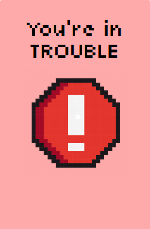

'You're in Trouble!'
  If you draw this card, and you don't have 'The Shield', you are indeed in trouble, and you'll be out of the game.

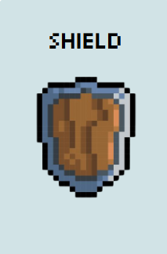

'The Shield'
  If you draw the 'You're in Trouble!' card, this card will be played- if you have it, to cancel out the effect of the trouble card.


- Action Cards: 

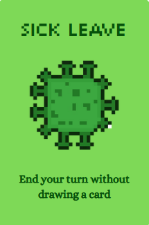

'Sick Leave' ×4
  End your turn without drawing a card.

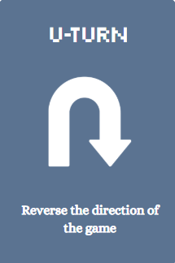

'U Turn' ×4
  Reverse the direction of the game turn.

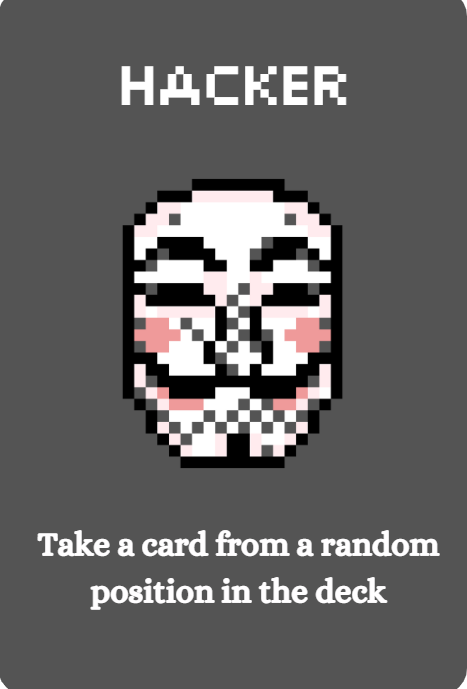

'Hacker' ×4
  Draw a card from a random position in the deck.

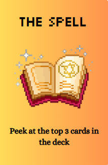

'The Spell' ×5
  Peek at the top three cards in the deck.


'Shuffle' ×4
  Shuffle the deck.

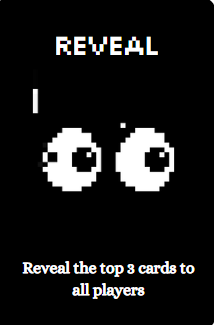

'Reveal' ×4
  Reveal the top three cards from the deck to all players.

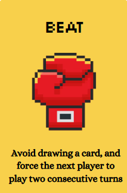

'Beat It' ×4
  Avoid drawing a card. Force next player to draw an extra card.

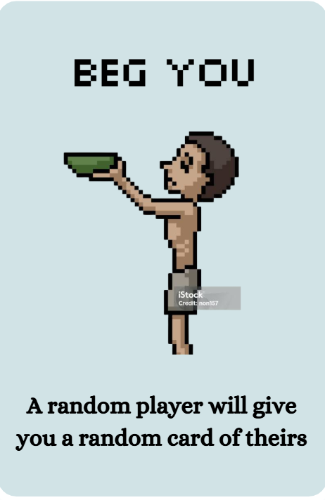

'Beg You' ×4
  A random player will give you a random card from their hand.


'Mirror' ×4
  Copy the last played action card.


- Character cards:

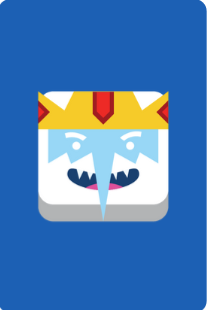

'Ice King' ×4


'BMO' ×4

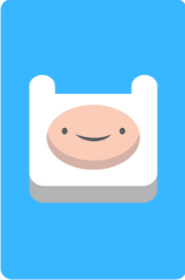

'Finn' ×4


'Jake' ×4

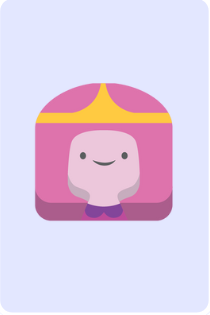

'Bubblegum' ×4

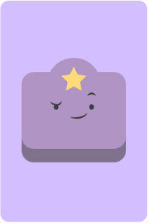

'Lumpy' ×4

Character cards cannot be played directly. There are special combinations to activate their effects:
  Combo Type 2 (T2):
Collect 2 of the same character.
Effect - Demand a random card from a random player.

  Combo Type 3 (T3):
Collect 3 of the same character.
Effect - Pick a card from the top 3 cards in the deck.

  Full Set Combo (Set):
collect 1 of each character.
Effect - Chose any action card or 'The Shield' to add to your hand.


### The Fun Begins
- ...


## References
- ... Note: Add image references


## 💻 Contribution Statement

