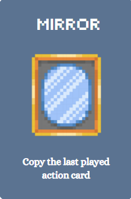

# 🃏 You're in Trouble - Card Game  

  

A strategic card game combining luck and tactics, built with Python and Pygame.

## 📋 User Guide  

## Prerequisites
### Software   
- **Python 3.8+**  
  Download: [python.org](https://www.python.org/downloads/)
- **Pygame**  
  Install via terminal:
  ```bash
  pip install pygame
or navigate to 'package' and search for Pygame through IDE settings and install it
  
### Hardware
- There are no specific hardware requirements.

## How to run the code
1. Clone the repository:

2. Navigate to the directory:

3. Run the game:


## 🎮 How to play

### Menu Screen
- A screen will appear with a button that says 'Start Game' as soon as you run the file, follow the instructions and start playing...

### Instructions
- If you draw a 'You're in Trouble' card you exit the game, unless you have 'The Shield' card which protects you.
- Since 'The Shield' is the only card that cancels the effect of the Trouble card...
- Therefore, each player must try and collect as many shields as possible
- All the other cards will help you prevent drawing the Trouble card 
- The game continues until one player remains, which is declared the winner!

  - Terminology:
* Card Deck: The pile of cards you draw from 
* Discard Pile: The pile that stores all played cards
* Action Cards: Cards that contain descriptions
* Character Cards: Cards without descriptions

### Initializing the Game
1. 'You're in Trouble' cards and 'The Shield' cards will be removed from the deck
2. The rest of the cards will be shuffled, then 5 cards will be dealt to each player
3. Each player will then receive 1 Shield card, therefore having a total of 6 cards in hand
4. 'You're in Trouble' cards are then added so that: if there are 3 players, only 2 Trouble cards will be inserted; if there are 4 players, only 3 Trouble cards will be inserted and so on...
5. The rest of the Shield cards are also added back to the deck 
6. The deck will be shuffled one last time before the game begins!

### Player Selection
- Chose to play against bots:
1.   2 Players - You and a Bot
2.   3 Players - You and 2 Bots
3.   4 Players - You and 3 Bots

### Game Rules
- In your turn you get a choice of playing as many times as you wish or none at all!
- But at the end you are forced to draw a card from the card deck to end your turn
- To play a card simply click on the card name displayed on your screen or chose a type of combo to activate for character cards (e.g., T2, T3, or Set)
- To end your turn, click the 'End Turn' button displayed on the lower-right side of your screen
- There is no limits to the amount of cards in your hand, but if you have no cards, you don't have a choice but to draw a card 

### Game Cards
- Main Cards:


'You're in Trouble!' ×5
  If you draw this card, and you don't have 'The Shield', you are indeed in trouble, and you'll be out of the game.


'The Shield' ×7
  If you draw the 'You're in Trouble!' card, this card will be played- if you have it, to cancel out the effect of the trouble card.


- Action Cards: 


'Sick Leave' ×4
  End your turn without drawing a card.


'U Turn' ×4
  Reverse the direction of the game turn.


'Hacker' ×4
  Draw a card from a random position in the deck.


'The Spell' ×5
  Peek at the top three cards in the deck.


'Shuffle' ×4
  Shuffle the deck.


'Reveal' ×4
  Reveal the top three cards from the deck to all players.


'Beat It' ×4
  Avoid drawing a card. Force next player to draw an extra card.


'Beg You' ×4
  A random player will give you a random card from their hand.




'Mirror' ×4
  Copy the last played action card.


- Character cards:


'Ice King' ×4


'BMO' ×4


'Finn' ×4


'Jake' ×4


'Bubblegum' ×4


'Lumpy' ×4


Character cards cannot be played directly. There are special combinations to activate their effects:

  - Combo Type 2 (T2):
Collect 2 of the same character.
Effect - Demand a random card from a random player.

  - Combo Type 3 (T3):
Collect 3 of the same character.
Effect - Pick a card from the top 3 cards in the deck.

  - Full Set Combo (Set):
collect 1 of each character.
Effect - Chose any action card or 'The Shield' to add to your hand.


### The Adventure Begin!
- Step into a game where strategy meets chance. Every move could lead you closer to victory- or a possible twist!
- Embark on an adventure where every card holds a new possibility. Gather your friends, get ready, and prepare for an unforgettable experience


## References
- ... Note: Add image references


## 💻 Contribution Statement
After discussing various card game ideas, the group selected Diana's idea as the best fit for the project requirements.
  - Task distributions and responsibilities:
Following the selection of the game concept, the group collaboratively assigned specific roles based on their strength points to ensure an efficient development.
* Rayan: 
Took charge of the backend development, focusing on implementing the core data structure for the card deck using a Red_Black Tree; a self_balancing binary search tree was chosen 
to maintain efficient operations such as insertion, deletion, and searching, ensuring optimal performance even as the deck changes in size. Additionally, Rayan developed bot players
integrating human logic to simulate human-like gameplay

* Diana: 
Contributed significantly by implementing the card classes, encapsulating the properties and behaviours of individual cards. She also developed the main game loop, managing
the flow of the game and ensuring seamless interactions between various components

* Braden:
Focused on the user interface (UI) development, creating an engaging experience for players. He also implemented dummy functions to facilitate the merging process, allowing
for smoother integration of the frontend and backend components 

All group members participated in merging the UI with the backend ensuring that the game logic was accurately reflected in the UI.
To assist users in understanding and navigating the game, Diana authored a comprehensive user guide. 
